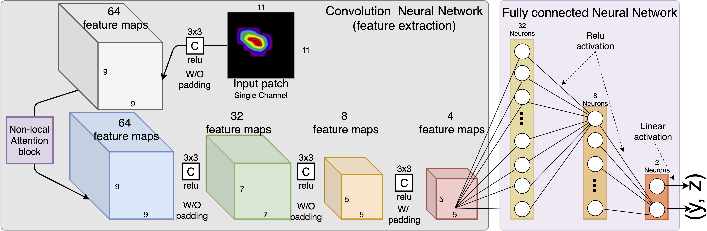

# About

This repository hosts the offical implementation of [BraggNN](https://arxiv.org/abs/2008.08198) for locating the Bragg peak position in a much fater way, compare with conventional Voigt fitting. The following figure shows an example of the model archtecture, the depth and size of CNN layers and Dense layers are customizable in the implementation.


# Notes

* The file names of the dataset are hard coded. you need to prepare your dataset and update the file name in the code.
* uncompress the dataset.tar.gz (to frames-exp4train.hdf5 and peaks-exp4train-psz11.hdf5 under folder dataset) if you want to try with our dataset.
* The code will use all available GPUs to data parallel training on the node if -gpus is provided.

# Requirement 

* PyTorch=1.5.0

# Import a pre-trained model for inference (peak locating)
```
model  = BraggNN(imgsz=, fcsz=) # should use the same argu as it in the training.
mdl_fn = 'models/fc16_8_4_2-sz11.pth'
model.load_state_dict(torch.load(mdl_fn, map_location=torch.device('cpu')))
```
Each patch must be rescaled using min-max normalization before feeding into the BraggNN for inference.

## Data preparaion 

* You need to crop the peaks with the patch size you used to when train the model. As described in the paper, we using Connected-component labeling algorithm to get all individaul peaks and then crop it based on the maixma location. The cropped patch will be the input of the model.
* Thus, the current design doesnot support overlapped peaks.

## run model to estimate peak center

Once patches are prepared, using code clip as follows for infernce
```
with torch.no_grad():
    pred = model.forward(X_test).cpu().numpy()  
```
## refer to demo-inference.ipynb for a complete sample code for inference 
`demo-inference.ipynb` has complete piece of code for inference (demo the process only, not for accuracy evaluation)

# Retrain

* We provied some pre-trained models (input patfh size is 11x11) which should work well if the patch size we used make sense in your experiment. 
* if you have ground truth data, we encourage you retrain model for your use case. we tried to simplify the way to retrain the model using your own data, you only need to prepare your data based on our requirment

## Data preparation for model re-training

* Two HDF5 files are need to train the model. 
* The first one, let's name it as frame.h5, contains your diffraction frames, this hdf5 file stores a 3D array (dataset name must be "frames"), and the first dimension is the frame ID starts with 0, i.e., the series of frames at different scanning angle. 
* The second hdf5 file stores the peak position information. In our paper, we used the peak position that we got using 2D psuedo Voigt fitting. This file stores three 1D array with each record / index represent different information of a peak. The first 1D array, must be named as "peak_fidx" represents the index of the frame (in the frames.h5) that the peak sits on; the second array, "peak_row" is the vertical distance, in pixel and can be floating point number, from the peak center to the top edge of the frame. Similarly, the "peak_col" denotes horizental distance, in pixel and can be floating point number, from peak center to left edge of the frame. 
* By default, this implementation will use 80% of the samples for training, the rest 20% for model validation.

## An Example of dataset meta
### frames.h5
```
HDF5 "frames.h5" {
GROUP "/" {
   DATASET "frames" {
      DATATYPE  H5T_IEEE_F32LE
      DATASPACE  SIMPLE { ( 1440, 2048, 2048 ) / ( 1440, 2048, 2048 ) }
   }
}
}
```

### peaks-exp4train-psz15.hdf5

```
HDF5 "peaks-exp4train-psz15.hdf5" {
GROUP "/" {
   DATASET "deviations" {
      DATATYPE  H5T_IEEE_F32LE
      DATASPACE  SIMPLE { ( 77267 ) / ( 77267 ) }
   }
   DATASET "npeaks" {
      DATATYPE  H5T_STD_U16LE
      DATASPACE  SIMPLE { ( 77267 ) / ( 77267 ) }
   }
   DATASET "peak_col" {
      DATATYPE  H5T_IEEE_F32LE
      DATASPACE  SIMPLE { ( 77267 ) / ( 77267 ) }
   }
   DATASET "peak_fidx" {
      DATATYPE  H5T_STD_U32LE
      DATASPACE  SIMPLE { ( 77267 ) / ( 77267 ) }
   }
   DATASET "peak_row" {
      DATATYPE  H5T_IEEE_F32LE
      DATASPACE  SIMPLE { ( 77267 ) / ( 77267 ) }
   }
}
}
```

## configuration and hyper-parameters

* all hyper parameters and model configurations are given by using augment passing. 
* Please refer the help of main.py, e.g., run python main.py --help to get explaination of each augment
* Once the training process is done, you are encouraged to check the validation error in the log file to find the best model checkpoint. 

## Horovod version
There is a version, `main-hvd.py` based on Horovod to make use of mutiple (or even distributed) GPUs for computing performance study only.
It is **not** encourged to use it for model/DNN performance study/reproducing.

# Advanced configuration for the model

* If you are working on normal diffractions that have reasonablly OK peaks, you do not need to customize the model. Based on our experience, the default model architecture should work reasonally well for any normal cases. The most you need is just a re-train. 

* If you have some basic knowledge about machine learning and know the intuition of tuning model size based on training error and validation error. You are encorage to keep reading instructions to change the size of the model.
